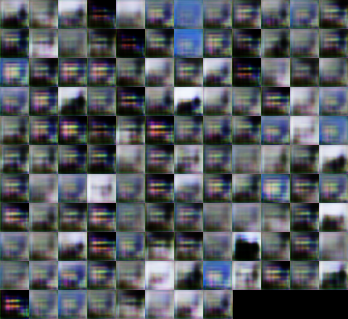
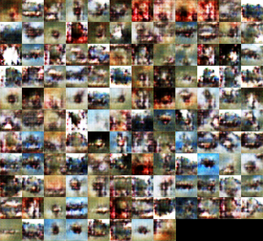

# GAN Resize Convolution

Comparison between a regular GAN and the *resize-convolution* propsed in the article [http://distill.pub/2016/deconv-checkerboard/](http://distill.pub/2016/deconv-checkerboard/) as an alternative to the standard deconvolution (transposed convolution) in the generator to get rid of the checkboard artifacts.

## Upsampling

The upsampling was made using the [2d unpooling](http://docs.chainer.org/en/stable/reference/functions.html#chainer.functions.unpooling_2d) function in Chainer which is very similar to a [nearest-neighbor interpolation](https://en.wikipedia.org/wiki/Image_scaling).

## Dataset

Training dataset of Cifar10.

## Results

We see that the artifacts are less noticeable in the resize-convolutions and that the images look more natural, but that the difference becomes less obvious as the training goes on.

Left images are images generated using a regular GAN and right images are generated using resize-convolutions. 

#### 1 Iteration (Left: Regular GAN, Right: Resize-convolution)

#### 1 Epochs

#### 2 Epochs

#### 3 Epochs

#### 4 Epochs

#### 5 Epochs

#### 6 Epochs

#### 7 Epochs

#### 8 Epochs

#### 9 Epochs

#### 10 Epochs

